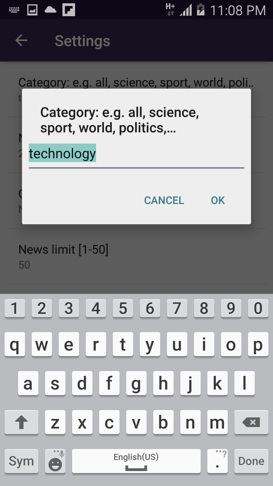

# Breaking News 

This is an app which gives a user regularly-updated news from the Guardian API related to different categories. 

The main screen displayes multiple news stories with relevant information: title, section, author, date, time.

Clicking on a story starts a new intent to open the story in the user's browser.

The app checks whether there is data to display or the device is connected to the internet, sending proper messages if not response. 

&nbsp;

&nbsp;

&nbsp;

&nbsp;

&nbsp;

&nbsp;

&nbsp;

